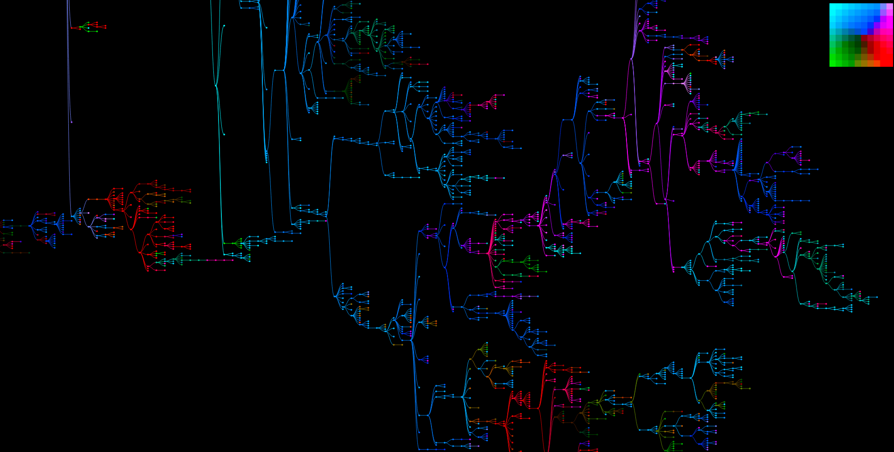

# Developing Software Standards for the Artificial Life Community
The Artificial Life (ALIFE) community is awash with disparate software systems, many of which produce data about the same underlying processes. This results in duplicated effort in developing analysis tools and visualizations. 
This workshop aims to start a community-level discussion about developing digital standards for common data types (*e.g.*, genomes, phylogenies, *etc.*). 

This workshop aims to start a conversation about identifying best practices and developing data and tool standards amongst individuals who design, develop, and use a wide range of artificial life systems, including artificial chemistries, abstract ecologies, evolutionary systems, and a range of other communities who express interest. 


## What can standards do for you?
Standards allow tools to be developed that can immediately be applied to multiple systems, reducing the inefficiencies of parallel development, encouraging the development of common benchmarks, and facilitating communication and cooperation among research groups. 
Many projects have solved some of these problems in individual systems, but these solutions are rarely portable and often must be reengineered for each system.
For example, [the Robot Operating System (ROS)](http://www.ros.org/) defines communication and data standards targeted toward the robotics community, which has facilitated massive community package development, sharing, and reuse. 

In addition to facilitating tool reuse, standards also make it possible to compare results across different systems (even to the point of using the same analysis tools). Further, standards could increase the incentive to develop solutions to some of the more elusive community-wide challenges. 

For example, any standard-conforming system could use [this visualization](https://emilydolson.github.io/visualizations/spatial_lineage/LineageViz.html) to explore evolving phylogenies! 



## Workshop Schedule

### Introduction (~10 minutes)
Cliff Bohm will provide an overview of the benefits and goals of data standards for  Artificial Life. What do we mean by a data standard? Why should we care about developing data standards? And, how do we get community buy-in? 

### Invited Talks (~5 minutes each)
There will be several invited talks, each to describe a particular ALIFE system and the data needs of that system. The speakers have been selected with the goal of achieving representation for vastly different systems used in the ALIFE community. 

Speakers:
- Charles Ofria (Avida)
- Penny Faulkner Rainford (Artificial Chemistries) 
- TBD

### Breakout Groups (45 minutes)
We will present a preliminary set of minimal standards for **phylogenies** and **genomes**. Participants will breakout into groups to discuss what might be missing in our presented standards.  

Each group will be given index cards to jot down system/data features that would benefit the standards. For example, how should mutations along a lineage be represented?  

### Group Coalescence (45 minutes)
After within-group discussion of standards, we will reconvene to discuss what changes are necessary to make the standards work for everyone. During this larger group discussion, we will categorize index cards from each breakout group as necessary, desirable, or unnecessary for inclusion in the standards. 

## Example Standard For a Phylogeny

```
{
  <taxon_id>:[<parent_1_id>, <parent_2_id>, ...],
  ...
}
```

`taxon_id` gives a unique identifier associated with an individual/genotype/phenotype/*etc* tracked by the phylogeny.

`parent_id`'s give the unique identifier associated with a 'parent' of an individual/genotype/phenotype/*etc* tracked by the phylogeny. 

**Note:** This is the minimal amount of information necessary to represent a phylogeny; however, it may be useful to include more information within the standard to facilitate more advanced analyses. 

**Note:** We are envisioning the use of JSON as the base standard format; however, this is up for discussion. 

## Organizers
- [Clifford Bohm](https://cliffbohm.weebly.com/) (cliff@msu.edu)
- [Emily Dolson](emilyldolson.com) (dolsonem@msu.edu)
- [Alex Lalejini](lalejini.com) (lalejini@msu.edu)
- [Charles Ofria](ofria.com) (ofria@msu.edu)
- Nitash CG (cgnitash@msu.edu)
